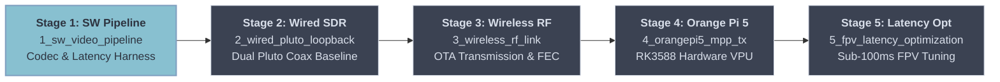

# gentoo_llwvs

**Project Gentoo LLWVS** (Low Latency Wireless Video Stream) is an open-source hardware/software co-design platform engineered for ultra-low latency 1080p video streaming over SDR (Software Defined Radio) RF channels.

Targeting an **Orange Pi 5** (Rockchip RK3588 SoC with hardware VPU) paired with an **ADALM-Pluto SDR** for **transmission (TX)**, and a **Linux PC host workstation** paired with a dedicated **ADALM-Pluto SDR** for **reception (RX)**, Gentoo LLWVS systematically compresses the traditional broadcast DATV latency envelope (typically 800 ms to 2500 ms) down to real-time FPV response times (targeting 40 ms to 100 ms glass-to-glass).

---

## 1. Repository Structure

In accordance with `RULE-REPO-001`, the repository enforces a modular, decoupled **Subproject-Driven Tripartite Architecture** separating specifications, hardware definitions, and software test suites across mirrored milestone subprojects:

```text
gentoo_llwvs/
├── readme.md                                       # Master repository guide, roadmap & status dashboard
├── .gitignore                                      # Build, log, and capture recording ignore rules
│
├── blueprints/                                     # Architectural blueprints & engineering specifications
│   ├── 1_sw_video_pipeline/                        # Stage 1: Software capture, encode & latency harness
│   │   ├── overall.md                              # Master cross-phase architecture blueprint
│   │   ├── phase_1.md                              # Detailed execution blueprint for Stage 1
│   │   └── summary.md                              # Post-execution verified benchmark report
│   ├── 2_wired_pluto_loopback/                     # Stage 2: Dual PlutoSDR wired loopback baseline
│   ├── 3_wireless_rf_link/                         # Stage 3: Wireless over-the-air link & FEC tuning
│   ├── 4_orangepi5_mpp_tx/                         # Stage 4: Orange Pi 5 RK3588 hardware VPU migration
│   └── 5_fpv_latency_optimization/                 # Stage 5: Aggressive FPV latency optimization
│
├── hw/                                             # Hardware definitions, carrier pinouts, RF configs
│   ├── common/                                     # Shared board profiles & RF parameters
│   │   ├── board_files/                            # Orange Pi 5 & PlutoSDR power/pinout specs
│   │   └── rf_configs/                             # Attenuators, antenna charts & channel allocations
│   └── subprojects/                                # Subproject hardware modules
│       ├── 1_sw_video_pipeline/                    # Sensor timing & UVC bandwidth requirements
│       ├── 2_wired_pluto_loopback/                 # GNU Radio flowgraphs (dvbs_tx.grc, dvbs_rx.grc)
│       ├── 3_wireless_rf_link/                     # Antenna gain models & RF band limits
│       ├── 4_orangepi5_mpp_tx/                     # OPi5 carrier thermal profiles & heatsink specs
│       └── 5_fpv_latency_optimization/             # MIPI-CSI daughterboard pinouts & schematics
│
└── sw/                                             # Embedded software, drivers, tests & benchmarks
    ├── common/                                     # Shared testing utilities & protocol wrappers
    │   ├── latency_meter/                          # Millisecond optical/OCR latency harness
    │   │   ├── screen_timer.py                     # High-precision millisecond video counter generator
    │   │   └── measure_latency.py                  # Automated OCR / delta-frame latency analyzer
    │   └── stream_utils/                           # Shared networking helpers
    │       ├── rtp_packetizer.py                   # Lightweight RTP transport wrapper
    │       └── nalu_parser.py                      # H.264/H.265 NAL unit boundary extractor
    └── subprojects/                                # Subproject software packages
        ├── 1_sw_video_pipeline/                    # Stage 1 software pipeline & benchmark scripts
        ├── 2_wired_pluto_loopback/                 # Stage 2 dual Pluto wired loopback test suites
        ├── 3_wireless_rf_link/                     # Stage 3 wireless link monitor & FEC switcher
        ├── 4_orangepi5_mpp_tx/                     # Stage 4 Rockchip MPP hardware encoder & deployer
        └── 5_fpv_latency_optimization/             # Stage 5 intra-refresh slicing & KMS/DRM display
```

---

## 2. Multi-Stage Project Roadmap



### Subproject Breakdown & Current Status

| Stage | Subproject | Description | Status | Primary Blueprint |
| :---: | :--- | :--- | :---: | :--- |
| **Stage 1** | **`1_sw_video_pipeline`** | Software video capture, zero-latency encoding (H.264/H.265/MJPEG), UDP/RTP transport, zero-buffer playback, and automated millisecond optical latency benchmark harness. | <span style="color: #88C0D0;">**Starting Next**</span> | [Link](blueprints/1_sw_video_pipeline/overall.md) |
| **Stage 2** | **`2_wired_pluto_loopback`** | Dual PlutoSDR wired RF loopback via coaxial cable and 30–40 dB attenuators. Recreates standard DVB-S modulation (`dvbs_tx.grc`, `leandvbtx`) to establish baseline DATV RF latency. | <span style="color: #EBCB8B;">**Planned**</span> | [Link](blueprints/2_wired_pluto_loopback/overall.md) |
| **Stage 3** | **`3_wireless_rf_link`** | Wireless over-the-air link transition using tuned antennas. Evaluates amateur/ISM band propagation, RSSI/SNR stability, and FEC code rate impact on packet loss and jitter. | <span style="color: #EBCB8B;">**Planned**</span> | [Link](blueprints/3_wireless_rf_link/overall.md) |
| **Stage 4** | **`4_orangepi5_mpp_tx`** | Transmitter migration to Orange Pi 5. Utilizes Rockchip MPP hardware VPU acceleration for zero-latency 1080p encoding streaming to PlutoSDR over USB 3.0. | <span style="color: #EBCB8B;">**Planned**</span> | [Link](blueprints/4_orangepi5_mpp_tx/overall.md) |
| **Stage 5** | **`5_fpv_latency_optimization`** | Aggressive latency reduction: intra-refresh slicing (zero I-frame burst), raw NALU/RTP streaming (bypassing MPEG-TS), MIPI-CSI camera ingest (<10 ms), and Linux KMS/DRM zero-copy display. | <span style="color: #EBCB8B;">**Planned**</span> | [Link](blueprints/5_fpv_latency_optimization/overall.md) |

---

## 3. End-to-End Latency Target Budget

```text
+-------------------------------------------------------------------------------------------------------+
|                                  END-TO-END VIDEO LATENCY BUDGET                                      |
|                                                                                                       |
|  [ Camera Sensor ]    [ Video Encoder ]    [ Transport / Mux ]    [ SDR TX Buffers ]                  |
|    1080p @ 60fps        H.264/H.265          RTP/UDP vs TS          Dual Pluto IIO                    |
|    ~16.6 ms             ~5 - 15 ms           ~1 - 5 ms              ~10 - 25 ms                       |
|         │                    │                    │                      │                            |
|         └────────────────────┴──────────┬─────────┴──────────────────────┘                            |
|                                         │                                                             |
|                                         v                                                             |
|                                   [ RF Channel ]                                                      |
|                                 (DVB-S / QPSK PHY)                                                    |
|                                         │                                                             |
|         ┌────────────────────┬──────────┴─────────┬──────────────────────┐                            |
|         │                    │                    │                      │                            |
|  [ SDR RX Buffers ]   [ Demod / FEC ]      [ Video Decoder ]      [ Display Render ]                  |
|    Dedicated Pluto      Symbol Recovery      VAAPI / MPP / NVDEC    DRM/KMS / OpenGL                  |
|    ~5 - 15 ms           ~10 - 20 ms          ~5 - 10 ms             ~5 - 16 ms                        |
|                                                                                                       |
|  Total Target Glass-to-Glass: ~50 ms - 100 ms (FPV Real-Time Feasibility Boundary)                   |
+-------------------------------------------------------------------------------------------------------+
```

---

## 4. Hardware Reference & Lab Configuration

- **Transmitter (TX) SDR**: ADALM-Pluto SDR (Zynq-7010 + AD9363), firmware v0.31+, tuned to carrier frequencies `437 MHz` / `970 MHz` / `1.2 GHz` / `2.4 GHz`.
- **Receiver (RX) SDR**: Dedicated ADALM-Pluto SDR (Zynq-7010 + AD9363) operated in receive mode.
- **Transmitter Compute**: Orange Pi 5 (Rockchip RK3588, 8-core CPU, ARM Mali-G610 GPU, 6 TOPS NPU, VPU with hardware H.264/H.265 multi-stream encoding).
- **Receiver Compute**: Linux x86_64 host workstation running Ubuntu 22.04 / 24.04 LTS.
- **Camera Sensors**:
  - Stages 1–4: Standard USB UVC webcam (1080p @ 30/60 fps).
  - Stage 5: Direct MIPI-CSI camera module (OV5647 / IMX415).
- **RF Cabling & Safety**: SMA coaxial cable with 30–40 dB inline attenuators for wired loopback testing. Never connect TX directly to RX without inline attenuators.

---

## 5. Primary References

- **Reference Architecture**: [LamaBleu/Pluto-DATV-test](https://github.com/LamaBleu/Pluto-DATV-test)
- **Modulation Engine**: [LeanDVB / LeanTRX (PABR Team / F4DAV)](http://www.pabr.org/radio/leantrx/leantrx.en.html)
- **Repository Architecture Standard**: [`dvs_skills/rules/repo_structure.md`](../dvs_skills/rules/repo_structure.md)
